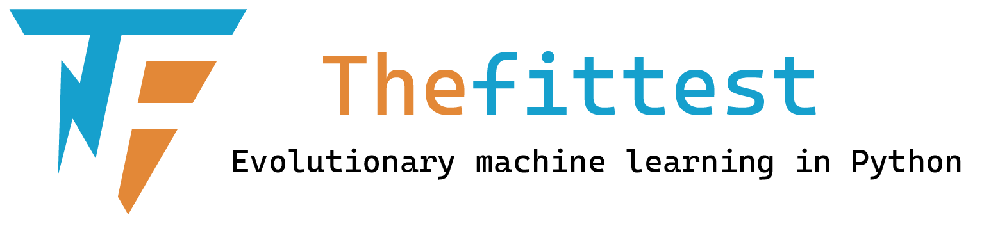

|pypi|_ |downloads|_ |views| |coverage|_ |codacy|_ |black|_ |docs|_

.. |pypi| image:: https://img.shields.io/pypi/v/thefittest?label=PyPI%20version
.. _pypi: https://pypi.org/project/thefittest/

.. |downloads| image:: https://static.pepy.tech/badge/thefittest
.. _downloads: https://pepy.tech/project/thefittest

.. |views| image:: https://komarev.com/ghpvc/?username=thefittest

.. |coverage| image:: https://codecov.io/github/sherstpasha/thefittest/coverage.svg?branch=master
.. _coverage: https://codecov.io/github/sherstpasha/thefittest

.. |codacy| image:: https://app.codacy.com/project/badge/Grade/4c47b6de61c4422180529bbc360262c4
.. _codacy: https://app.codacy.com/gh/sherstpasha/thefittest/dashboard

.. |black| image:: https://img.shields.io/badge/code%20style-black-000000.svg
.. _black: https://github.com/psf/black

.. |docs| image:: https://img.shields.io/badge/docs-online-brightgreen
.. _docs: https://sherstpasha.github.io/thefittest/

``thefittest`` is an open-source library designed for the efficient application of classical evolutionary algorithms and their effective modifications in optimization and machine learning. Our project aims to provide performance, accessibility, and ease of use, opening up the world of advanced evolutionary methods to you.

Features of ``thefittest``
--------------------------

**Performance**
  Our library is developed using advanced coding practices and delivers high performance through integration with `NumPy <https://numpy.org/>`_, `SciPy <https://scipy.org/>`_, and `Numba <https://numba.pydata.org/>`_.

**Versatility**
  ``thefittest`` offers a wide range of classical evolutionary algorithms and effective modifications, making it suitable for a variety of optimization and machine learning tasks.

**Integration with scikit-learn**
  Machine learning models from ``thefittest`` follow the familiar `scikit-learn <https://scikit-learn.org/>`_ interface and can be used with its preprocessing, model selection, and evaluation tools.

**PyTorch support**
  ``thefittest`` supports `PyTorch <https://pytorch.org/>`_ for efficient neural network computations and evolutionary optimization of neural network weights and architectures, including GPU acceleration with CUDA.

Usage Example
-------------

The following example demonstrates how to use ``thefittest`` library with the SHADE optimizer to minimize a custom objective function. This quick start example showcases the main components needed to set up and run an optimization.

.. code-block:: python

    from thefittest.optimizers import SHADE

    # Define the objective function to minimize
    def custom_problem(x):
        return (5 - x[:, 0])**2 + (12 - x[:, 1])**2

    # Initialize the SHADE optimizer with custom parameters
    optimizer = SHADE(
        fitness_function=custom_problem,
        iters=25,
        pop_size=10,
        left_border=-100,
        right_border=100,
        num_variables=2,
        show_progress_each=10,
        minimization=True,
    )

    # Run the optimization
    optimizer.fit()

    # Retrieve and print the best solution found
    fittest = optimizer.get_fittest()
    print('The fittest individ:', fittest['phenotype'])
    print('with fitness', fittest['fitness'])

Machine Learning Example
------------------------

This example demonstrates how to train a machine learning model on the Iris dataset using ``thefittest`` library's ``MLPEAClassifier`` with the SHAGA evolutionary optimizer.

.. code-block:: python

    from thefittest.optimizers import SHAGA
    from thefittest.benchmarks import IrisDataset
    from thefittest.classifiers import MLPEAClassifier

    from sklearn.model_selection import train_test_split
    from sklearn.preprocessing import minmax_scale
    from sklearn.metrics import confusion_matrix, f1_score

    # Load the Iris dataset
    data = IrisDataset()
    X = data.get_X()
    y = data.get_y()

    # Scale features to the [0, 1] range
    X_scaled = minmax_scale(X)

    # Split the data into training and test sets
    X_train, X_test, y_train, y_test = train_test_split(X_scaled, y, test_size=0.1)

    # Initialize the MLPEAClassifier with SHAGA as the optimizer
    model = MLPEAClassifier(
        n_iter=500,
        pop_size=500,
        hidden_layers=[5, 5],
        weights_optimizer=SHAGA,
        weights_optimizer_args={"show_progress_each": 10}
    )

    # Train the model
    model.fit(X_train, y_train)
    
    # Make predictions on the test set
    predict = model.predict(X_test)

    # Evaluate the model
    print("confusion_matrix: \n", confusion_matrix(y_test, predict))
    print("f1_score: \n", f1_score(y_test, predict, average="macro"))

Installation
------------

Install ``thefittest`` from PyPI:

.. code-block:: bash

    pip install thefittest

``thefittest`` contains methods
-------------------------------

- **Genetic algorithm** (Holland, J. H. (1992). Genetic algorithms. Scientific American, 267(1), 66-72):

  - **Self-configuring genetic algorithm** (`Semenkin, E.S., Semenkina, M.E. Self-configuring Genetic Algorithm with Modified Uniform Crossover Operator. LNCS, 7331, 2012, pp. 414-421. <https://doi.org/10.1007/978-3-642-30976-2_50>`_);
  - **SHAGA** (`Stanovov, Vladimir & Akhmedova, Shakhnaz & Semenkin, Eugene. (2019). Genetic Algorithm with Success History based Parameter Adaptation. 180-187. <http://dx.doi.org/10.5220/0008071201800187>`_);
  - **PDPGA** (`Niehaus, J., Banzhaf, W. (2001); Adaption of Operator Probabilities in Genetic Programming. In: Miller, J., Tomassini, M., Lanzi, P.L., Ryan, C., Tettamanzi, A.G.B., Langdon, W.B. (eds) Genetic Programming. EuroGP 2001. Lecture Notes in Computer Science, vol 2038. Springer, Berlin, Heidelberg. <https://doi.org/10.1007/3-540-45355-5_26>`_).

- **Differential evolution** (Storn, Rainer & Price, Kenneth. (1995). Differential Evolution: A Simple and Efficient Adaptive Scheme for Global Optimization Over Continuous Spaces. Journal of Global Optimization. 23)

  - **jDE** (`Brest, Janez & Greiner, Sao & Bošković, Borko & Mernik, Marjan & Zumer, Viljem. (2007). Self-Adapting Control Parameters in Differential Evolution: A Comparative 13. 945 - 958. <http://dx.doi.org/10.1109/TEVC.2009.2014613>`_);
  - **SHADE** (`Tanabe, Ryoji & Fukunaga, Alex. (2013). Success-history based parameter adaptation for Differential Evolution. 2013 IEEE Congress on Evolutionary Computation, CEC 2013. 71-78. <https://doi.org/10.1109/CEC.2013.6557555>`_).

- **Genetic programming** (Koza, John R.. “Genetic programming - on the programming of computers by means of natural selection.” Complex Adaptive Systems (1993)):

  - **Self-configuring genetic programming** (`Semenkin, Eugene & Semenkina, Maria. (2012). Self-configuring genetic programming algorithm with modified uniform crossover. 1-6. <http://dx.doi.org/10.1109/CEC.2012.6256587>`_).
  - **PDPGP** (`Niehaus, J., Banzhaf, W. (2001); Adaption of Operator Probabilities in Genetic Programming. In: Miller, J., Tomassini, M., Lanzi, P.L., Ryan, C., Tettamanzi, A.G.B., Langdon, W.B. (eds) Genetic Programming. EuroGP 2001. Lecture Notes in Computer Science, vol 2038. Springer, Berlin, Heidelberg. <https://doi.org/10.1007/3-540-45355-5_26>`_).

- **Genetic programming of neural networks (GPNN)** (`Lipinsky L., Semenkin E., Bulletin of the Siberian State Aerospace University., 3(10), 22-26 (2006). In Russian`_);
- **Multilayer perceptron trained by evolutionary algorithms** (`Cotta, Carlos & Alba, Enrique & Sagarna, R. & Larranaga, Pedro. (2002). Adjusting Weights in Artificial Neural Networks using Evolutionary Algorithms. <http://dx.doi.org/10.1007/978-1-4615-1539-5_18>`_);

Articles
--------

Publications where ``thefittest`` has been used:

- *Thefittest: evolutionary machine learning in Python*, January 2024, ITM Web of Conferences 59.
  DOI: 10.1051/itmconf/20245902020. Licensed under CC BY 4.0. Authored by Pavel Sherstnev.
  Available at: https://doi.org/10.1051/itmconf/20245902020
- (in Russian) Демидов Н. Аспекты реализации генетического алгоритма в задачах смешанной оптимизации в пространстве переменной размерности // *International Journal of Open Information Technologies*. — 2026. — Т. 14, № 5. — С. 110–123.
  Available at: http://injoit.ru/index.php/j1/article/view/2562
  (transliteration) Demidov N. Aspekty realizatsii geneticheskogo algoritma v zadachakh smeshannoy optimizatsii v prostranstve peremennoy razmernosti // *International Journal of Open Information Technologies*. — 2026. — Vol. 14, No. 5. — P. 110–123.
- (in Russian) Масленников В. В. Квантово-инспирированный генетический алгоритм вещественной однокритериальной оптимизации с адаптацией значений параметров на основе истории успеха // *ИТ-Стандарт*. — 2025. — № 4(45). — С. 81–101. — EDN KJRSYX.
  (transliteration) Maslennikov V. V. Kvantovo-inspirovannyy geneticheskiy algoritm veshchestvennoy odnokriterial'noy optimizatsii s adaptatsiyey znacheniy parametrov na osnove istorii uspekha // *IT-Standart*. — 2025. — No. 4(45). — P. 81–101.
- (in Russian) Демидов Н. А. Решение задачи одноклассовой классификации в пространстве проектирования переменной размерности на примере наборов регулярных выражений // *Вестник Рязанского государственного радиотехнического университета*. — 2026. — № 96-1. — С. 98–114.
  (transliteration) Demidov N. A. Reshenie zadachi odnoklassovoy klassifikatsii v prostranstve proektirovaniya peremennoy razmernosti na primere naborov regulyarnykh vyrazheniy // *Vestnik Ryazanskogo gosudarstvennogo radiotekhnicheskogo universiteta*. — 2026. — No. 96-1. — P. 98–114.

Awards and Presentations
-------------------------

- **1st place**, Samsung Innovation Campus (IT Academy), *Artificial Intelligence* track, October 2024. `Read more <https://news.samsung.com/ru/объявлены-итоги-ежегодного-межвузов>`_;  
- **Best PhD Student Paper** at the 12th International Workshop on Mathematical Models and their Applications (IWMMA'2023) for the paper "Thefittest: Evolutionary Machine Learning in Python" by Pavel Sherstnev. `Watch presentation <https://youtu.be/R46b1tt5qUo?si=ZxGIcX2-sWJEWCbt&t=4550>`_;  
- **Tutorial** Presenter at the 13th International Workshop on Mathematical Models and their Applications (IWMMA'2024) with the tutorial titled "Thefittest Library: Evolutionary Algorithms and Automation of Machine Learning Models Design in Python". `Watch tutorial <https://www.youtube.com/watch?v=PtDahwMstuw>`_;  
- **2nd place**, Youth IT Project Competition "Soft-Parade 2025". `More details <https://www.soft-parade.ru/archive>`_
- **2nd place**, GitVerse, Cloud.ru and Habr Open Source Grant Program "Code Without Borders" 2025. `More details <https://gitverse.ru/blog/articles/open-source/1172-pozdravlyaem-pobeditelej-grantovoj-programmy-kod-bez-granic>`_
- **International University Award "Gravitation" 2025** in the category *"Algorithms and Software Solutions in AI and Big Data"*, awarded by the Presidential Academy, Tomsk State University, and the Association *"University Consortium of Big Data Researchers"*. `More details <https://gravitation.ai/2025>`_

Documentation
-------------

For detailed installation instructions, usage examples, API reference, and additional information, see the `official documentation <https://sherstpasha.github.io/thefittest/>`_.
